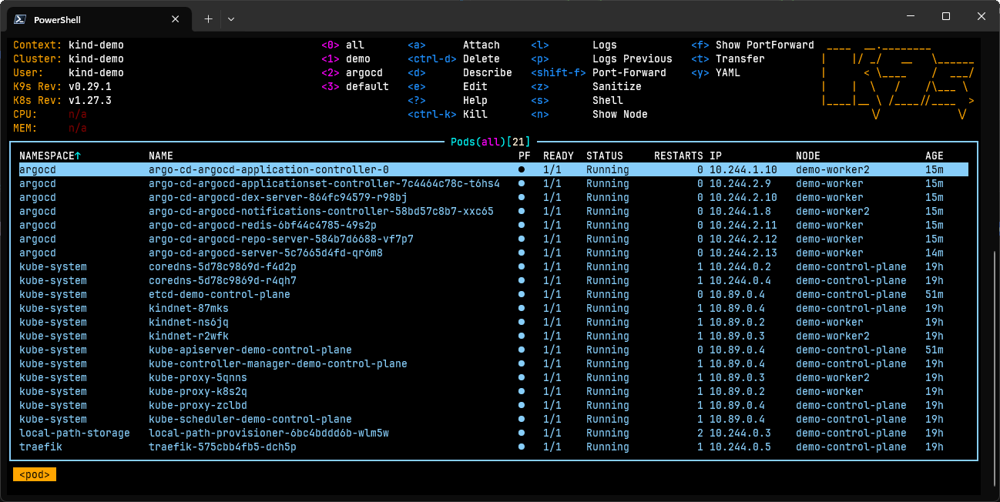

# ops-demo-config

[ArgoCD](https://argo-cd.readthedocs.io/en/stable/) configuration for [ops-demo-app](https://github.com/si618/ops-demo-app) based on [Nana Janashia's tutorial](https://youtu.be/MeU5_k9ssrs) 🙇‍♂️

## Setup

```bash
git clone https://github.com/si618/ops-demo-config
cd ./ops-demo-config
```

### Installation using Podman on WSL

```bash
winget install argoproj.argocd redhat.podman redhat.podman-desktop `
    kubernetes.kubectl kubernetes.kind helm.helm derailed.k9s `
    --accept-package-agreements --accept-source-agreements --silent
```

Setup podman on [WSL instance](https://podman-desktop.io/docs/kind/configuring-podman-for-kind-on-windows)

```bash
podman machine init --memory=8192 --disk-size=80 --rootful --now demo-machine
```

For other operating systems, follow installation guides for
[ArgoCD](https://argo-cd.readthedocs.io/en/stable/cli_installation/#installation),
[Podman](https://podman.io/docs/installation),
[Podman Desktop](https://podman-desktop.io/docs/installation),
[Kubernetes](https://kubernetes.io/docs/tasks/tools/),
[Kind](https://kind.sigs.k8s.io/docs/user/quick-start/),
[Helm](https://helm.sh/docs/intro/install/) and
[K9s](https://k9scli.io/topics/install/)

### Create Kubernetes cluster

```bash
kind create cluster -n demo --config ./config/kind.config.yaml
```

### Add Helm repositories

```bash
helm repo add argo https://argoproj.github.io/argo-helm
helm repo add traefik https://traefik.github.io/charts
helm repo update
```

### Install Traefik

```bash
helm install traefik traefik/traefik -n traefik --create-namespace -f ./config/traefik.values.yaml

# Wait until deployment is finished
kubectl -n traefik wait --for=condition=Ready pods --all --timeout=88s

kubectl apply -f ./config/traefik.ingressroute.yaml
```

Traefik dashboard should now be available at
[http://localhost/dashboard/](http://localhost/dashboard/)

### Install Argo CD

```bash
helm install argo-cd argo/argo-cd -n argocd --create-namespace -f ./config/argocd.values.yaml

# Wait until deployment is finished
kubectl -n argocd wait --for=condition=Ready pods --all --timeout=88s

# Change argocd-dashboard from ClusterIP to LoadBalancer to enable host access
kubectl patch svc argo-cd-argocd-server -n argocd -p '{"spec": {"type": "LoadBalancer"}}'

# Change argocd-server to run insecurely for demo
kubectl patch deployment argo-cd-argocd-server --patch-file ./config/argocd.patch.json --type=json

# Create ingress route for argocd UI
kubectl apply -f ./config/argocd.ingressroute.yaml

# Output initial user password for 'admin' user
argocd admin initial-password -n argocd
```

ArgoCD UI should now be available at [https://localhost](https://localhost)

### Verify cluster

Run `K9s` or your preferred tool to verify deployments are operational



### Create application

TODO

### Deploy to cluster

```bash
kubectl create namespace demo
kubectl apply -f ./application.yaml
```
